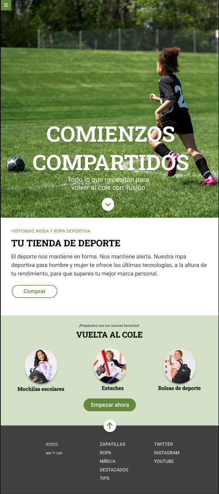

# Evaluación Final Adalab. Módulo 1

Este ejercicio consiste en desarrollar una página web de acuerdo a un diseño que nos han proporcionado. Hay que resolver varios puntos:

- Usar Sass.
- Usar flexbox y CSS Grid.
- Usar media queries.
- Como extra: resolver algunas interacciones usando transiciones.

## El diseño proporcionado es el siguiente:

## Requisitos a cumplir:

1. **Menú de hamburguesa:** El botón de hamburguesa (en la esquina superior izquierda) debe estar fijo en la parte superior de la pantalla y no debe desaparecer al hacer scroll. El icono de la hamburguesa debe ser un enlace a la página de Adalab. Este menú de hamburguesa no despliega ningún submenú.

2. **Primer módulo (hero - Comienzos compartidos):** Debe estar maquetado con Flexbox y debe ocupar el alto de la ventana del navegador.

3. **Segundo módulo (Tu tienda de deporte):** Se puede maquetar usando las propiedades de CSS que se deseen.

4. **Tercer módulo (Vuelta al cole):** Los 3 elementos del listado deben estar maquetados con CSS Grid en todos los tamaños de pantalla en los que se necesite.

5. **Cuarto módulo (footer):** Se debe maquetar usando flexbox. Todos los textos de la columna "ZAPATILLAS" y todos los textos de la columna "TWITTER" deben ser enlaces a la página de Adalab.

## Interacciones:

1. El botón de flecha del primer módulo (el hero) debe enlazar a la sección "Vuelta al cole".

2. El botón de flecha que está sobre el footer debe enlazar al inicio de la página (hero).

3. Todos los links del pie deben ir a [Adalab](https://adalab.es).

4. **BONUS a investigar:** En el `:hover` de los botones ("Comprar" y "Empezar ahora") se debe incluir una propiedad `transform` que dejamos a vuestra elección (y, como idea, hacer la transform junto con `transition`, para investigar la propiedad `transition`).

5. **BONUS a investigar:** Hacer una pequeña animación en el botón del footer (para investigar las propiedades `animation`).

---
## Entrega:

La fecha de entrega para esta evaluación es el **Lunes, 04 de septiembre de 2023** a las **14:00h**.

### Criterios de Evaluación

La evaluación se considerará **terminada** cuando se cumplan los siguientes criterios:

1. **Publicación en GitHub Pages y funcionamiento:** Debes configurar GitHub Pages en la página "Settings" de tu repositorio y subir el código necesario a la carpeta `docs/` del repositorio. Asegúrate de que tu sitio web esté funcionando correctamente en GitHub Pages.

2. **Enlace a GitHub Pages:** El enlace a tu sitio web en GitHub Pages debe estar ubicado en la página principal del repositorio, en la parte superior derecha junto a la descripción, en la sección "About".

---

## Ejercicio Realizado Por

[**@MayteGonz**](https://github.com/MayteGonz)

